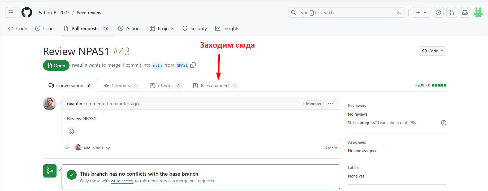
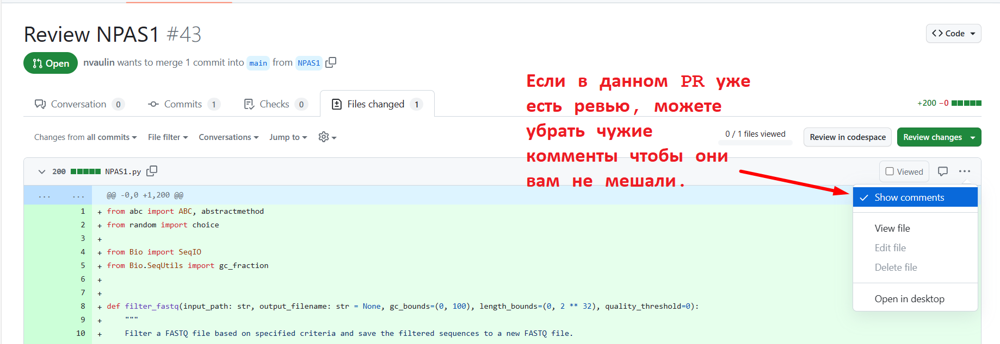
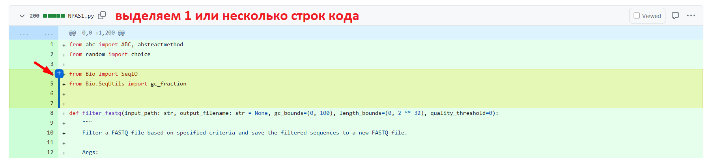
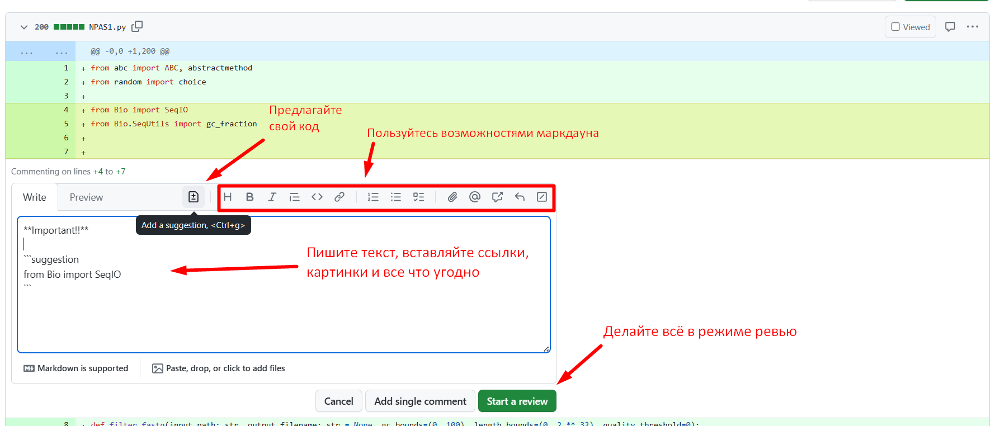
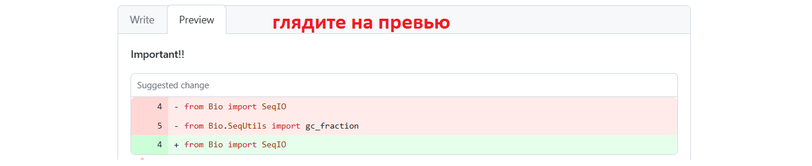
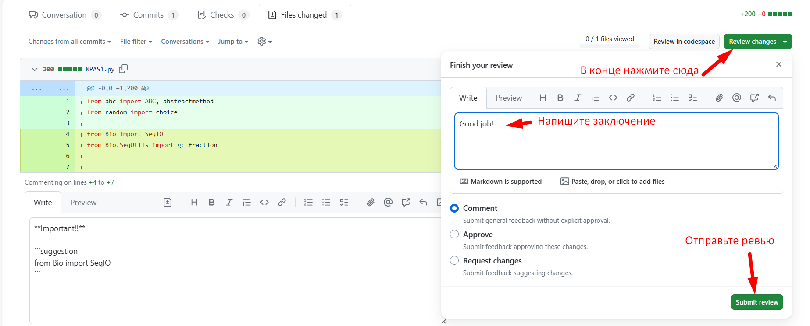

# HW 12. Peer Review 

Вот и подходит к концу наш первый семестр курса по Python. Мы писали свой код и получали фидбек на него. Пришло время почувствовать себя и с другой стороны этого процесса. А заодно научиться тому как это происходит на GitHub.

## Часть 1. Оценка репозиториев

Вы получили в на gmail-почту от меня 3 имена трех генов. Первый ген обозначает под каким именем лежит ваш код. Так вы сможете увидеть чужие ревью на свой код. Другие 2 гена - это названия pull-request'ов которые нужно отревьюить вам.

1. Зайдите в репозиторий для peer-review (https://github.com/Python-BI-2024-25/Peer_review)
2. Найдите PR который вы должны отревьюить, зайдите в него.
3. Далее следуйте инструкциям на скриншотах чтобы познакомиться с тем как работает система Code review на GitHub.

#### Некоторые правила:

- Будьте подробны, но вежливы.
- Не забывайте подчеркивать хорошие моменты и хвалить людей.
- Если вы видете код сильно лучше чем у вас - берите что-нибудь себе на заметку. Если видете код сильно хуже чем у вас - относитесь к автору кода лояльно и эмпатично.
- Берите все самые лучше моменты из того ревью, что получали вы на свой код. Не лучше не берите :)
- Помните, что ваш ревью могут увидеть другие люди. Пусть они подумают что у вас очень крутой код ревью!
- ❗️Если до вас в том же PR уже кто-то оставил свои комментарии - это не повод для вас не оставлять ваши. Помните, ***проверяться будет именно то как ВЫ сделали ревью***. За сообщение "выше уже всё сказали" я баллов поставить не смогу. ❗️

#### Баллы
 - Ревью 1: 20 баллов
 - Ревью 2: 20 баллов

Суммарно 40 баллов за всё задание.

## Часть 2. Фидбек

Нам был бы очень полезен и интересен ваш фидбек по первому семестру курса Python. Это не обязательно, но если будет желание - заполните, пожалуйста, [вот эту гугл-форму](https://docs.google.com/forms/d/e/1FAIpQLSdJwROVKbw8AKTTVpAAwtApmw3oYIM77k-zQQCr1or3vJasgw/viewform?usp=sf_link). Спасибо :)

### Дополнение: Как делать ревью?

Вот некоторые инструкции:

